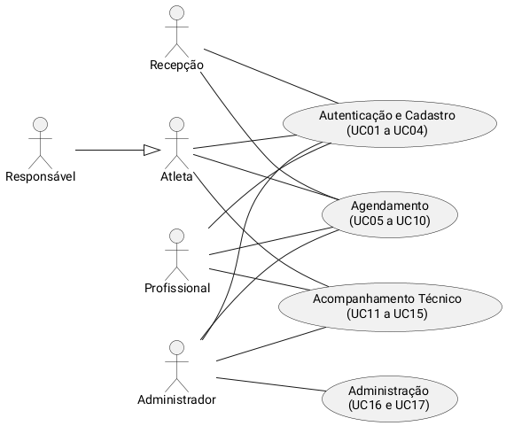
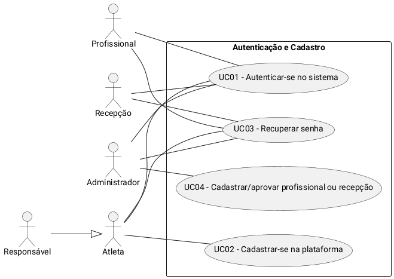
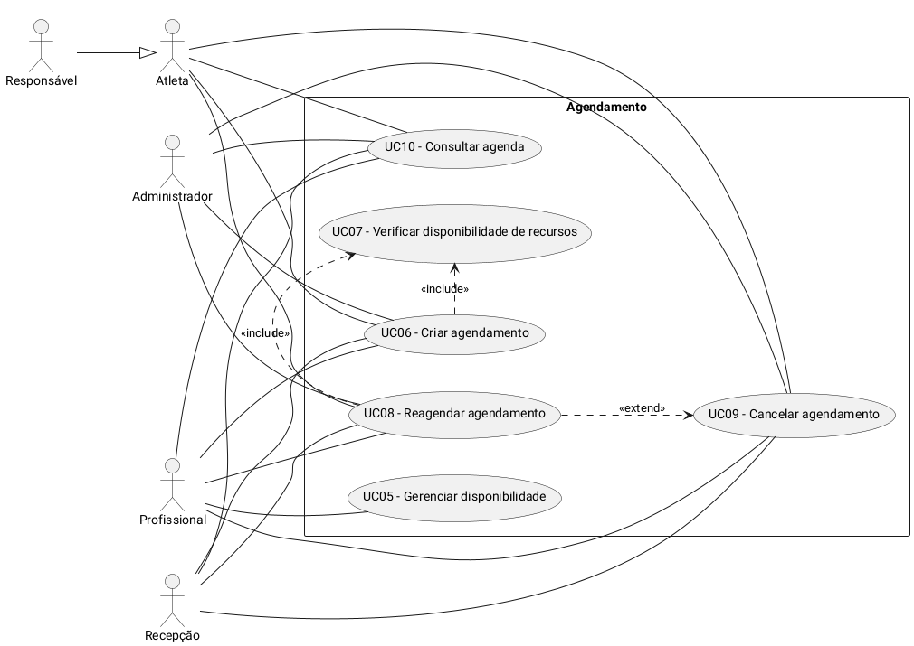
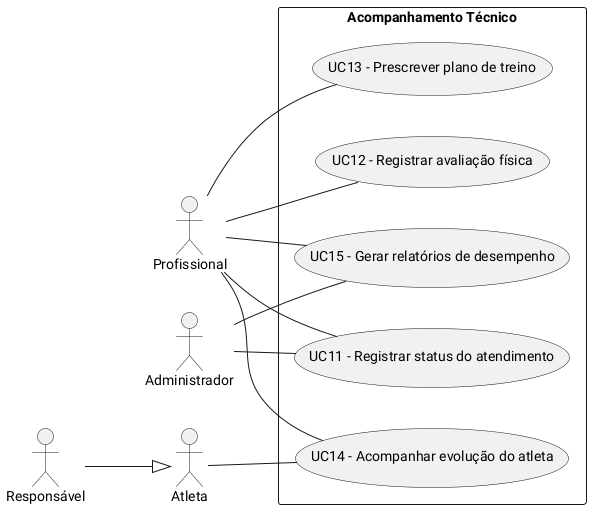
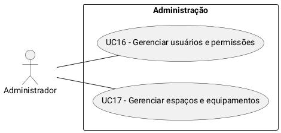

## Introdução

O caso de uso é uma técnica de especificação de requisitos que descreve a interação entre os atores (usuários ou sistemas externos) e o sistema, detalhando o objetivo dessa interação, as condições necessárias para que ela ocorra e os fluxos de eventos até seu resultado. No contexto do projeto, os casos de uso consolidam, em um formato estruturado, os requisitos já levantados no Brainstorm, no 5W2H, na Pesquisa e nas telas do Protótipo de Baixa Fidelidade, servindo de base para a modelagem de dados e para a definição dos endpoints da API REST do PKZ LAB.

## Metodologia

A equipe partiu dos requisitos elicitados no Brainstorm (BS01 a BS15), dos perfis de usuário descritos no Mapa Mental e no Protótipo de Baixa Fidelidade e dos fluxos de navegação já validados (autenticação/cadastro e agendamento com verificação de disponibilidade) para identificar os casos de uso do sistema. Para cada caso de uso foram definidos: ator(es), pré-condições, fluxo principal, fluxos alternativos e pós-condições. Em seguida, os casos de uso foram relacionados entre si por meio de <code>&lt;&lt;include&gt;&gt;</code> e <code>&lt;&lt;extend&gt;&gt;</code> quando havia reaproveitamento de comportamento, e representados em um diagrama de casos de uso em PlantUML, no mesmo padrão de diagramação já adotado no Mapa Mental e no Protótipo. Por fim, cada caso de uso foi validado contra os requisitos do Brainstorm, garantindo rastreabilidade entre as técnicas de elicitação aplicadas no projeto.

## Atores

Os atores foram definidos a partir dos perfis já descritos no Mapa Mental e na tabela de visibilidade do Protótipo de Baixa Fidelidade:

| Ator | Descrição |
| -- | -- |
| **Atleta** | Usuário do centro de treinamento que acompanha sua própria evolução, agenda e avaliações. |
| **Responsável** | Representa legalmente um atleta menor de idade (ECA); herda as ações do ator Atleta em relação ao(s) dependente(s) vinculado(s). |
| **Profissional** | Equipe técnica do CT (Personal Trainer, Preparador Físico, Fisioterapeuta, Nutricionista), responsável por avaliações, planos de treino e atendimentos. |
| **Recepção** | Realiza agendamentos e consultas em nome de atletas e profissionais, com visão da agenda geral do CT. |
| **Administrador** | Coordenação do CT; gerencia usuários, permissões, espaços, equipamentos e possui visão irrestrita da agenda. |

O ator <strong>Responsável</strong> é uma especialização de <strong>Atleta</strong> (generalização de ator): tudo o que o Responsável pode fazer é executado em nome do atleta vinculado, conforme já estabelecido no Protótipo de Baixa Fidelidade. Da mesma forma, <strong>Personal Trainer</strong>, <strong>Preparador Físico</strong>, <strong>Fisioterapeuta</strong> e <strong>Nutricionista</strong> são especializações de <strong>Profissional</strong>, não sendo tratados como atores distintos neste documento por compartilharem o mesmo conjunto de casos de uso.

## Diagrama de Casos de Uso

### Versão 1.1

Com 17 casos de uso e 5 atores, um único diagrama concentrando todas as associações resulta em muitas linhas cruzadas, prejudicando a leitura. Por isso, o diagrama foi dividido em uma <strong>visão geral</strong>, agrupando os casos de uso por área funcional, e em <strong>quatro diagramas detalhados</strong>, um por área, mantendo apenas os atores e relacionamentos relevantes a cada um.

#### Visão geral 

#### Diagrama detalhado — Autenticação e Cadastro

#### Diagrama detalhado — Agendamento

#### Diagrama detalhado — Acompanhamento Técnico

#### Diagrama detalhado — Administração

## Lista de Casos de Uso

| ID | Nome | Ator principal | Relacionamento | Requisito(s) |
| -- | -- | -- | -- | -- |
| UC01 | Autenticar-se no sistema | Todos os perfis | — | BS12, BS13 |
| UC02 | Cadastrar-se na plataforma | Atleta, Responsável | — | BS01, BS13 |
| UC03 | Recuperar senha | Todos os perfis | — | BS13 |
| UC04 | Cadastrar/aprovar profissional ou recepção | Administrador | — | BS02, BS12, BS13 |
| UC05 | Gerenciar disponibilidade | Profissional | — | BS06 |
| UC06 | Criar agendamento | Atleta, Responsável, Profissional, Recepção, Administrador | inclui UC07 | BS05, BS06, BS11 |
| UC07 | Verificar disponibilidade de recursos | (interno, acionado por UC06/UC08) | incluído por UC06 e UC08 | BS06 |
| UC08 | Reagendar agendamento | Atleta, Responsável, Profissional, Recepção, Administrador | inclui UC07; estende UC09 | BS05, BS06, BS14 |
| UC09 | Cancelar agendamento | Atleta, Responsável, Profissional, Recepção, Administrador | estendido por UC08 | BS10, BS14 |
| UC10 | Consultar agenda | Todos os perfis | — | BS11, BS12 |
| UC11 | Registrar status do atendimento | Profissional, Administrador | — | BS08, BS10 |
| UC12 | Registrar avaliação física | Profissional | — | BS03, BS07 |
| UC13 | Prescrever plano de treino | Profissional | — | BS04, BS07 |
| UC14 | Acompanhar evolução do atleta | Atleta, Responsável, Profissional | — | BS07, BS09 |
| UC15 | Gerar relatórios de desempenho | Profissional, Administrador | — | BS09 |
| UC16 | Gerenciar usuários e permissões | Administrador | — | BS12, BS13, BS14 |
| UC17 | Gerenciar espaços e equipamentos | Administrador | — | BS06, BS14 |

## Detalhamento dos Casos de Uso

### UC01 — Autenticar-se no sistema

- **Atores:** Atleta, Responsável, Profissional, Recepção, Administrador.
- **Pré-condições:** Usuário possui cadastro ativo (aprovado) na plataforma.
- **Fluxo principal:**
  1. Usuário acessa a tela de login.
  2. Usuário informa e-mail e senha.
  3. Sistema valida as credenciais.
  4. Sistema identifica o perfil do usuário e carrega o painel correspondente, aplicando o controle de acesso por perfil.
- **Fluxos alternativos:**
  - **A1 — Credenciais inválidas:** sistema exibe mensagem genérica ("E-mail ou senha incorretos"), sem indicar qual campo falhou, e retorna ao passo 2.
  - **A2 — Cadastro pendente de aprovação:** sistema exibe "Cadastro em análise pela administração" e impede o acesso.
  - **A3 — "Manter-me conectado" marcado:** sistema prolonga a validade da sessão no dispositivo.
- **Pós-condições:** Sessão autenticada criada; usuário passa a acessar apenas os dados e funcionalidades permitidos ao seu perfil.

---

### UC02 — Cadastrar-se na plataforma

- **Atores:** Atleta, Responsável (em nome de atleta menor de idade).
- **Pré-condições:** Não existe conta cadastrada com o e-mail informado.
- **Fluxo principal:**
  1. Usuário acessa "Criar conta".
  2. Usuário preenche nome completo, e-mail, telefone, senha e confirmação de senha.
  3. Usuário seleciona o tipo de perfil (Atleta ou Responsável) e informa a data de nascimento.
  4. Usuário aceita os termos de uso e a política de privacidade (LGPD).
  5. Sistema valida os dados e cria a conta.
  6. Sistema ativa a conta automaticamente, conforme a política de autocadastro do CT.
- **Fluxos alternativos:**
  - **A1 — Atleta menor de 18 anos:** sistema torna obrigatório o vínculo com um responsável (e-mail do responsável) antes de concluir o cadastro, em conformidade com o ECA.
  - **A2 — E-mail já cadastrado:** sistema recusa o cadastro e sinaliza o campo com mensagem de erro; retorna ao passo 2.
  - **A3 — Senhas não coincidem:** sistema sinaliza o campo "Confirmar senha" e retorna ao passo 2.
- **Pós-condições:** Conta criada (ativa ou pendente de vínculo com responsável); consentimento LGPD registrado com data e hora.

---

### UC03 — Recuperar senha

- **Atores:** Atleta, Responsável, Profissional, Recepção, Administrador.
- **Pré-condições:** Usuário possui conta cadastrada.
- **Fluxo principal:**
  1. Usuário seleciona "Esqueci minha senha" na tela de login.
  2. Usuário informa o e-mail cadastrado.
  3. Sistema envia um link de redefinição de senha para o e-mail informado.
  4. Usuário acessa o link, define e confirma uma nova senha.
  5. Sistema atualiza a senha.
- **Fluxos alternativos:**
  - **A1 — E-mail não cadastrado:** por segurança, o sistema exibe a mesma mensagem de confirmação de envio, sem indicar se o e-mail existe na base.
- **Pós-condições:** Senha atualizada; usuário pode autenticar-se (UC01) com a nova senha.

---

### UC04 — Cadastrar/aprovar profissional ou recepção

- **Atores:** Administrador (primário); Profissional/Recepção (secundário, solicitante do cadastro).
- **Pré-condições:** Administrador autenticado (UC01).
- **Fluxo principal:**
  1. Profissional ou funcionário de recepção realiza o autocadastro na plataforma.
  2. Sistema registra a conta com status "pendente" e sem permissões operacionais.
  3. Administrador acessa a lista de cadastros pendentes.
  4. Administrador analisa os dados e aprova o cadastro.
  5. Sistema ativa a conta e libera as permissões correspondentes ao perfil.
- **Fluxos alternativos:**
  - **A1 — Rejeição do cadastro:** sistema mantém a conta inativa e registra o motivo informado pelo administrador; usuário é notificado.
- **Pós-condições:** Conta de profissional/recepção ativa com permissões liberadas, ou cadastro rejeitado.

---

### UC05 — Gerenciar disponibilidade

- **Atores:** Profissional (primário); Administrador (secundário, pode configurar em nome do profissional).
- **Pré-condições:** Profissional autenticado (UC01) e com conta ativa.
- **Fluxo principal:**
  1. Profissional acessa a área de disponibilidade.
  2. Profissional define os horários em que está disponível para atendimento.
  3. Profissional bloqueia horários específicos (folgas, compromissos).
  4. Sistema salva a disponibilidade e passa a considerá-la nas verificações de agendamento (UC07).
- **Fluxos alternativos:**
  - **A1 — Bloqueio sobre horário com agendamento já confirmado:** sistema alerta o profissional sobre o conflito antes de confirmar o bloqueio.
- **Pós-condições:** Disponibilidade do profissional atualizada e refletida nas próximas verificações de agendamento.

---

### UC06 — Criar agendamento

- **Atores:** Atleta, Responsável, Profissional, Recepção, Administrador.
- **Pré-condições:** Usuário autenticado; existem profissionais, espaços e horários cadastrados.
- **Fluxo principal:**
  1. Usuário acessa "Novo agendamento".
  2. Usuário informa tipo de agendamento (individual ou em grupo), atleta(s), profissional, data, horário de início e término, espaço, equipamentos (opcional) e repetição.
  3. Usuário aciona "Verificar disponibilidade" *(inclui UC07 — Verificar disponibilidade de recursos)*.
  4. Sistema confirma que todos os recursos estão livres.
  5. Usuário confirma o agendamento.
  6. Sistema cria o agendamento com status "Agendado" e gera um número de protocolo.
- **Fluxos alternativos:**
  - **A1 — Conflito de disponibilidade:** sistema segue o fluxo de exceção do UC07; usuário ajusta os dados preenchidos (que são preservados) e repete o passo 3.
  - **A2 — Agendamento em grupo:** sistema limita a quantidade de atletas à capacidade do espaço selecionado.
  - **A3 — Agendamento recorrente:** sistema executa a verificação (UC07) para cada ocorrência da série e lista individualmente as datas com conflito.
- **Pós-condições:** Agendamento (ou série de agendamentos) registrado e disponível para consulta pelos perfis autorizados (UC10).
- **Relacionamentos:** `<<include>>` UC07 — Verificar disponibilidade de recursos.

---

### UC07 — Verificar disponibilidade de recursos

- **Atores:** Caso de uso interno, acionado por UC06 (Criar agendamento) e UC08 (Reagendar agendamento).
- **Pré-condições:** Período, atleta(s), profissional, espaço e equipamentos informados pelo caso de uso solicitante.
- **Fluxo principal:**
  1. Sistema verifica a disponibilidade do(s) atleta(s) no período informado.
  2. Sistema verifica a disponibilidade do profissional.
  3. Sistema verifica a disponibilidade do espaço.
  4. Sistema verifica a disponibilidade dos equipamentos selecionados.
  5. Sistema verifica bloqueios por manutenção ou indisponibilidade.
  6. Sistema retorna "Horário disponível" e habilita a confirmação do agendamento.
- **Fluxos alternativos:**
  - **A1 — Recurso ocupado ou bloqueado:** sistema identifica o recurso em conflito, o horário e o agendamento existente, mantém os dados preenchidos para ajuste e, quando possível, sugere um horário alternativo.
- **Pós-condições:** Resultado da verificação (disponível ou em conflito) retornado ao caso de uso solicitante.
- **Relacionamentos:** incluído por UC06 e UC08.

---

### UC08 — Reagendar agendamento

- **Atores:** Atleta, Responsável, Profissional, Recepção, Administrador.
- **Pré-condições:** Existe um agendamento futuro com status "Agendado".
- **Fluxo principal:**
  1. Usuário seleciona o agendamento em "Minha agenda".
  2. Usuário escolhe "Reagendar" e informa a nova data/horário (e demais dados, se necessário).
  3. Sistema verifica a disponibilidade do novo horário *(inclui UC07)*.
  4. Usuário confirma a alteração.
  5. Sistema efetiva o cancelamento do agendamento original *(estende UC09 — Cancelar agendamento)* e cria o novo agendamento, vinculado ao anterior para fins de histórico.
- **Fluxos alternativos:**
  - **A1 — Conflito no novo horário:** sistema mantém o agendamento original ativo e solicita novo ajuste.
- **Pós-condições:** Agendamento original marcado como substituído (não excluído); novo agendamento ativo com status "Agendado".
- **Relacionamentos:** `<<include>>` UC07 — Verificar disponibilidade de recursos; `<<extend>>` de UC09 — Cancelar agendamento.

---

### UC09 — Cancelar agendamento

- **Atores:** Atleta, Responsável, Profissional, Recepção, Administrador.
- **Pré-condições:** Existe um agendamento com status "Agendado".
- **Fluxo principal:**
  1. Usuário seleciona o agendamento a cancelar.
  2. Usuário informa uma justificativa.
  3. Sistema altera o status do agendamento para "Cancelado".
  4. Sistema libera o espaço, o profissional e os equipamentos reservados de volta à agenda.
- **Fluxos alternativos:**
  - **A1 — Cancelamento de agendamento recorrente:** sistema pergunta se o cancelamento se aplica somente à ocorrência selecionada ou a toda a série.
- **Pós-condições:** Registro do agendamento preservado para auditoria (não é excluído); recursos envolvidos liberados na agenda.
- **Relacionamentos:** estende UC08 — Reagendar agendamento (ponto de extensão: cancelamento do agendamento original ao concluir um reagendamento).

---

### UC10 — Consultar agenda

- **Atores:** Atleta, Responsável, Profissional, Recepção, Administrador.
- **Pré-condições:** Usuário autenticado.
- **Fluxo principal:**
  1. Usuário acessa "Minha agenda".
  2. Usuário aplica filtros (período, status e, para perfis administrativos, profissional/espaço).
  3. Sistema retorna somente os agendamentos permitidos ao perfil e aos vínculos do usuário autenticado, filtrando sempre no back-end.
- **Fluxos alternativos:**
  - **A1 — Nenhum agendamento encontrado para o filtro:** sistema exibe lista vazia com mensagem informativa.
- **Pós-condições:** Lista de agendamentos exibida conforme a permissão do usuário.

---

### UC11 — Registrar status do atendimento

- **Atores:** Profissional (primário), Administrador.
- **Pré-condições:** Agendamento com status "Agendado" cujo horário já ocorreu ou está em curso.
- **Fluxo principal:**
  1. Profissional acessa o agendamento correspondente.
  2. Profissional registra o status: presença, falta ou cancelamento.
  3. Sistema exige justificativa quando o status for "Falta" ou "Cancelamento".
  4. Sistema salva o registro com autor, data e hora.
- **Fluxos alternativos:**
  - **A1 — Status "Cancelamento":** sistema libera o espaço e os equipamentos de volta à agenda.
- **Pós-condições:** Histórico do atendimento atualizado; o registro passa a compor os indicadores de evolução do atleta (UC14).

---

### UC12 — Registrar avaliação física

- **Atores:** Profissional.
- **Pré-condições:** Atleta cadastrado e vinculado ao profissional.
- **Fluxo principal:**
  1. Profissional seleciona o atleta.
  2. Profissional registra os testes realizados (velocidade, força, resistência, agilidade) com a data da avaliação.
  3. Sistema salva a avaliação e a associa ao histórico do atleta.
  4. Sistema disponibiliza a comparação com avaliações anteriores.
- **Fluxos alternativos:**
  - **A1 — Primeira avaliação do atleta:** sistema não exibe comparação, por ausência de histórico anterior.
- **Pós-condições:** Avaliação registrada e disponível para consulta pelo atleta/responsável e pela equipe técnica.

---

### UC13 — Prescrever plano de treino

- **Atores:** Profissional.
- **Pré-condições:** Atleta cadastrado; avaliação física prévia recomendada.
- **Fluxo principal:**
  1. Profissional seleciona o atleta.
  2. Profissional define exercícios, objetivos, frequência, carga e observações.
  3. Profissional define a periodização/ciclo do plano.
  4. Sistema salva o plano e o vincula ao atleta.
- **Fluxos alternativos:**
  - **A1 — Atualização de plano existente:** sistema mantém o histórico das versões anteriores do plano.
- **Pós-condições:** Plano de treino ativo, disponível para o atleta e para consulta da equipe técnica.

---

### UC14 — Acompanhar evolução do atleta

- **Atores:** Atleta, Responsável, Profissional.
- **Pré-condições:** Existem avaliações e/ou atendimentos registrados para o atleta.
- **Fluxo principal:**
  1. Usuário acessa o histórico do atleta.
  2. Sistema apresenta indicadores de evolução (avaliações, frequência, planos de treino ao longo do tempo).
  3. Usuário compara períodos ou testes específicos.
- **Fluxos alternativos:**
  - **A1 — Ausência de dados suficientes:** sistema informa que não há histórico suficiente para comparação.
- **Pós-condições:** Indicadores de evolução exibidos conforme os dados disponíveis e o perfil do usuário.

---

### UC15 — Gerar relatórios de desempenho

- **Atores:** Profissional, Administrador.
- **Pré-condições:** Existem dados de avaliações, treinos e atendimentos registrados.
- **Fluxo principal:**
  1. Usuário acessa a área de relatórios.
  2. Usuário seleciona o período e o(s) atleta(s)/profissional(is) de interesse.
  3. Sistema consolida os indicadores (progresso, frequência, evolução) e apresenta o relatório.
- **Fluxos alternativos:**
  - **A1 — Sem dados no período selecionado:** sistema informa a ausência de dados para o filtro aplicado.
- **Pós-condições:** Relatório apresentado, servindo de base para decisões técnicas e administrativas.

---

### UC16 — Gerenciar usuários e permissões

- **Atores:** Administrador.
- **Pré-condições:** Administrador autenticado.
- **Fluxo principal:**
  1. Administrador acessa a área de gestão de usuários.
  2. Administrador consulta, edita ou inativa contas de usuários.
  3. Administrador ajusta o nível de acesso (perfil/permissões) de cada usuário.
  4. Sistema aplica as alterações imediatamente às próximas autenticações (UC01).
- **Fluxos alternativos:**
  - **A1 — Inativação de usuário com agendamentos futuros:** sistema alerta o administrador sobre os agendamentos pendentes antes de concluir a inativação.
- **Pós-condições:** Permissões e status de usuários atualizados conforme definido pelo administrador.

---

### UC17 — Gerenciar espaços e equipamentos

- **Atores:** Administrador.
- **Pré-condições:** Administrador autenticado.
- **Fluxo principal:**
  1. Administrador acessa a área de espaços e equipamentos.
  2. Administrador cadastra, edita ou inativa salas, quadras e equipamentos.
  3. Administrador registra bloqueios por manutenção, informando o período de indisponibilidade.
  4. Sistema passa a considerar os bloqueios nas verificações de disponibilidade (UC07).
- **Fluxos alternativos:**
  - **A1 — Bloqueio sobre horário já reservado:** sistema alerta o administrador sobre os agendamentos que serão impactados.
- **Pós-condições:** Espaços e equipamentos atualizados e refletidos nas próximas verificações de agendamento.

## Rastreabilidade com os Requisitos do Brainstorm

| Requisito (Brainstorm) | Descrição resumida | Caso(s) de uso relacionado(s) |
| -- | -- | -- |
| BS01 | Cadastro de atletas | UC02 |
| BS02 | Cadastro de profissionais | UC04 |
| BS03 | Avaliações físicas e indicadores | UC12 |
| BS04 | Criação/atualização de planos de treino | UC13 |
| BS05 | Agendamento de atendimentos | UC06 |
| BS06 | Controle de disponibilidade (atletas, profissionais, espaços, equipamentos) | UC05, UC07, UC17 |
| BS07 | Histórico de evolução do atleta | UC12, UC13, UC14 |
| BS08 | Registro de observações e acompanhamento | UC11 |
| BS09 | Relatórios e indicadores de progresso | UC14, UC15 |
| BS10 | Controle de presença | UC09, UC11 |
| BS11 | Informações sobre agenda e compromissos | UC06, UC10 |
| BS12 | Diferentes níveis de acesso por perfil | UC01, UC10, UC16 |
| BS13 | Confidencialidade e segurança dos dados sensíveis | UC01, UC02, UC04, UC16 |
| BS14 | Organização das rotinas e operações do CT | UC08, UC09, UC16, UC17 |
| BS15 | Comunicação e compartilhamento de informações entre equipe e atletas | UC11 (parcial) |

O requisito <strong>BS15</strong> é atendido apenas parcialmente nesta versão: o compartilhamento de informações ocorre por meio do campo de observações associado a agendamentos e avaliações (UC06, UC11, UC12). Funcionalidades de mensagens e notificações automatizadas — já mapeadas no Mapa Mental na seção "Automação" — não fazem parte do MVP e ficam previstas para iterações futuras.

## Conclusão

A definição dos casos de uso permitiu transformar os requisitos elicitados no Brainstorm e os fluxos validados no Protótipo de Baixa Fidelidade em especificações estruturadas, com atores, pré-condições, fluxos e pós-condições claramente delimitados. A modelagem evidenciou a verificação de disponibilidade (UC07) como o comportamento central do sistema, reaproveitado pelos casos de uso de criação e reagendamento de atendimentos, e reforçou a necessidade de controle de acesso por perfil em todas as interações. Este documento, junto ao diagrama de casos de uso, servirá de referência direta para a modelagem de dados e para a definição dos endpoints da API REST na fase de Elaboração do projeto.

## Referências Bibliográficas

> PRESSMAN, R. S.; MAXIM, B. R. Engenharia de Software: uma abordagem profissional. McGraw-Hill, 2016.

> LARMAN, C. Utilizando UML e Padrões: uma introdução à análise e ao projeto orientados a objetos. Bookman, 2007.

> BOOCH, G.; RUMBAUGH, J.; JACOBSON, I. UML: Guia do Usuário. Elsevier, 2005.

> PlantUML. Use Case Diagram. Disponível em: https://plantuml.com/use-case-diagram

## Autor(es)

| Data | Versão | Descrição | Autor(es) |
| -- | -- | -- | -- |
| 23/09/2026 | 1.0 | Criação do documento de casos de uso, a partir do Brainstorm, 5W2H, Pesquisa, Mapa Mental e Protótipo de Baixa Fidelidade | Gabriel de Souza, Vitor Luiz Zanconato, Vitor Magalhães e Filipe Andrade |
| 23/09/2026 | 1.1 | Diagrama de casos de uso dividido em visão geral por área funcional e quatro diagramas detalhados, para reduzir o cruzamento de linhas | Gabriel de Souza, Vitor Luiz Zanconato, Vitor Magalhães e Filipe Andrade |
