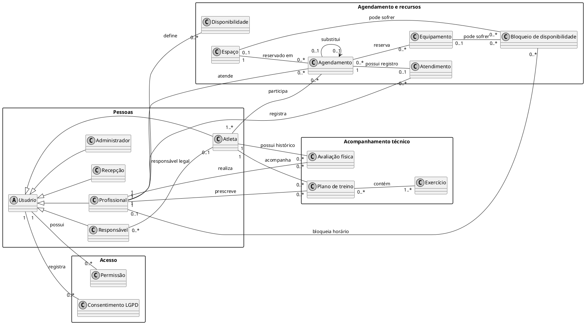

## Diagrama de Classes

### Objetivo

Este diagrama representa os principais conceitos do domínio do PKZ LAB, sistema back-end para apoiar as rotinas de um centro de treinamento. O modelo conceitual organiza os perfis de usuário, os agendamentos e recursos, e o acompanhamento técnico dos atletas, evidenciando seus relacionamentos com base nos requisitos, casos de uso e protótipo. Nesta versão, as classes são intencionalmente apresentadas sem atributos e métodos.

### Componentes do Diagrama de Classes

Este documento define um modelo para:

1. #### Diagrama conceitual

As classes são apresentadas sem atributos e sem métodos. O diagrama contempla os conceitos de pessoas, agendamentos, recursos e acompanhamento técnico identificados nos casos de uso.

(visão de domínio)

2. **Evolução para o Diagrama de Classes de Especificação** (visão de projeto).  

Ambos devem ser derivados de:

- Casos de uso;
- Diagrama de casos de uso;
- Documento de levantamento de requisitos;
- Protótipo de baixa fidelidade.

### Fontes de entrada obrigatórias

- **Levantamento de requisitos**: requisitos funcionais e não funcionais.
- **Casos de uso**: atores, fluxos principal e alternativos.
- **Diagrama de casos de uso**: escopo e fronteiras do sistema.
- **Protótipo de baixa fidelidade**: entidades percebidas na interface e regras de navegação.

### 1) Diagrama de Classes Conceitual

#### 1.1 Finalidade

Identificar e organizar os conceitos do domínio necessários para compreender as funcionalidades descritas nos casos de uso, sem detalhar implementação. O diagrama dá ênfase às associações, às multiplicidades e às generalizações entre perfis.

#### 1.2 Escopo

- Perfis de usuário do centro de treinamento: atleta, responsável, profissional, recepção e administrador;
- Acesso e consentimento relacionados à autenticação, às permissões e ao cadastro;
- Agendamento, disponibilidade, bloqueios, espaços, equipamentos e registro de atendimento;
- Acompanhamento técnico do atleta por avaliações físicas, planos de treino e exercícios;
- Associações, multiplicidades e generalizações necessárias para expressar os vínculos do domínio.

O escopo não inclui componentes técnicos da API, como telas, endpoints, controladores ou repositórios.

#### 1.3 Notação mínima

O diagrama utiliza notação UML e segue estas regras:

- Cada classe contém somente seu nome; não são incluídos atributos nem métodos;
- Associações representam vínculos identificados nos casos de uso e no domínio do projeto;
- Multiplicidades indicam quantas instâncias podem participar de cada associação;
- Generalizações são usadas para representar especializações de perfis quando aplicável;
- Não são incluídos detalhes de implementação nem classes técnicas.

#### 1.4 Rastreabilidade

A tabela relaciona cada classe aos requisitos do Brainstorm (`BS`), aos casos de uso (`UC`) e às telas do Protótipo de Baixa Fidelidade que fornecem evidência para o conceito. Quando o protótipo não apresenta uma tela para determinada classe, isso é indicado explicitamente.

| Classe Conceitual | Requisito(s) | Caso(s) de Uso | Tela/Protótipo |
|---|---|---|---|
| Usuário | BS12, BS13 | UC01, UC02, UC03, UC04, UC16 | Tela 1 — Login; Tela 1b — Cadastro |
| Atleta | BS01, BS05, BS06, BS07, BS11 | UC02, UC06, UC07, UC08, UC09, UC10, UC12, UC14 | Tela 1b — Cadastro; Tela 2 — Informações de agendamento; Tela 5 — Minha agenda |
| Responsável | BS01, BS12, BS13 | UC02, UC06, UC08, UC09, UC10, UC14 | Tela 1b — Cadastro; Tela 2 — Informações de agendamento; Tela 5 — Minha agenda |
| Profissional | BS02, BS06, BS07, BS08, BS09, BS10, BS11, BS15 | UC04, UC05, UC06, UC07, UC08, UC09, UC10, UC11, UC12, UC13, UC14, UC15 | Tela 1 — Login; Tela 2 — Informações de agendamento; Tela 5 — Minha agenda; Tela 6 — Registro de status do atendimento |
| Recepção | BS05, BS11, BS12 | UC01, UC03, UC04, UC06, UC08, UC09, UC10 | Tela 1 — Login; Tela 2 — Informações de agendamento; Tela 5 — Minha agenda |
| Administrador | BS12, BS13, BS14 | UC01, UC03, UC04, UC06, UC08, UC09, UC10, UC11, UC15, UC16, UC17 | Tela 1 — Login; demais telas administrativas não detalhadas no protótipo |
| Permissão | BS12, BS13 | UC01, UC04, UC16 | Tela 1 — Login; Tela 1b — Cadastro |
| Consentimento LGPD | BS13 | UC02 | Tela 1b — Cadastro |
| Agendamento | BS05, BS06, BS10, BS11, BS14 | UC06, UC07, UC08, UC09, UC10, UC11 | Tela 2 — Informações de agendamento; Tela 3 — Verificação de disponibilidade; Tela 4 — Confirmação do agendamento; Tela 5 — Minha agenda; Tela 6 — Registro de status do atendimento |
| Disponibilidade | BS06 | UC05, UC07, UC17 | Tela 2 — Informações de agendamento; Tela 3 — Verificação de disponibilidade |
| Bloqueio de disponibilidade | BS06, BS14 | UC05, UC07, UC17 | Tela 3 — Verificação de disponibilidade; gestão de bloqueios não detalhada no protótipo |
| Espaço | BS06, BS14 | UC06, UC07, UC17 | Tela 2 — Informações de agendamento; Tela 3 — Verificação de disponibilidade |
| Equipamento | BS06, BS14 | UC06, UC07, UC17 | Tela 2 — Informações de agendamento; Tela 3 — Verificação de disponibilidade |
| Atendimento | BS08, BS10, BS15 | UC11, UC14, UC15 | Tela 6 — Registro de status do atendimento |
| Avaliação física | BS03, BS07, BS09 | UC12, UC14, UC15 | Não detalhada no protótipo |
| Plano de treino | BS04, BS07, BS09 | UC13, UC14, UC15 | Não detalhada no protótipo |
| Exercício | BS04 | UC13 | Não detalhada no protótipo |

#### 1.5 Critérios de validação

- Cada classe deve corresponder a um conceito do domínio e estar ligada a pelo menos um requisito ou caso de uso;
- As classes devem conter somente seus nomes, sem atributos ou métodos;
- Os relacionamentos, multiplicidades e generalizações devem ser compatíveis com os fluxos e regras descritos nos documentos do projeto;
- Os nomes devem manter a terminologia usada nos casos de uso e no protótipo;
- Não devem ser incluídas classes técnicas nem conceitos fora do escopo do PKZ LAB;
- Cada linha de rastreabilidade deve apontar para referências existentes; a ausência de tela no protótipo deve ser identificada, não presumida.

### 2) Transição para Diagrama de Classes de Especificação

#### 2.1 Objetivo
Refinar o modelo conceitual para uma estrutura orientada à implementação.

#### 2.2 Regras de refinamento

- Converter conceitos em classes de software quando aplicável;
- Definir tipos de atributos e visibilidade;
- Incluir operações principais;
- Aplicar estereótipos quando necessário (ex.: `<<entity>>`, `<<service>>`, `<<boundary>>`);
- Preservar rastreabilidade com requisitos e casos de uso.

#### 2.3 Itens esperados por classe

- **Nome da classe**;
- **Atributos** (`nome: tipo [visibilidade]`);
- **Métodos/operações** (`assinatura`);
- **Responsabilidade**;
- **Dependências e associações**;
- **Restrições/invariantes** (quando houver).

### 3) Diagrama de Classes de Especificação

#### 3.1 Conteúdo mínimo

- Classes de domínio e de apoio à aplicação;
- Interfaces relevantes;
- Associações, agregações/composições e heranças;
- Multiplicidades e navegabilidade;
- Operações alinhadas aos fluxos dos casos de uso.

#### 3.2 Rastreabilidade

| Classe de Especificação | Origem Conceitual | Requisito(s) | Caso(s) de Uso |
|---|---|---|---|
| `<ClasseSpec>` | `<ClasseConceitual>` | `RF-xx` | `UC-xx` |

#### 3.3 Critérios de qualidade

- Cobertura dos requisitos funcionais;
- Coesão alta e acoplamento controlado;
- Nomes consistentes com o domínio;
- Ausência de classes sem responsabilidade clara.

### 4) Estrutura de versionamento e revisão

- **Versão**: `v0.1`
- **Data**: `25/09/2026`
- **Autor(es)**: Gabriel de Souza, Vitor Luiz Zanconato, Vitor Magalhães e Filipe Andrade
- **Revisor(es)**: Gabriel de Souza, Vitor Luiz Zanconato, Vitor Magalhães e Filipe Andrade
- **Resumo da alteração**: Inclusão do Diagrama de Classes Conceitual, com classes vazias e relacionamentos derivados dos Casos de uso, Documento de Levantamento de Requisitos e Protótipo de Baixa fidelidade do PKZ LAB.

### 5) Entregáveis

- Diagrama de Classes Conceitual (imagem + fonte);
- Diagrama de Classes de Especificação (imagem + fonte);
- Tabelas de rastreabilidade preenchidas;
- Registro de validação com equipe e stakeholders.