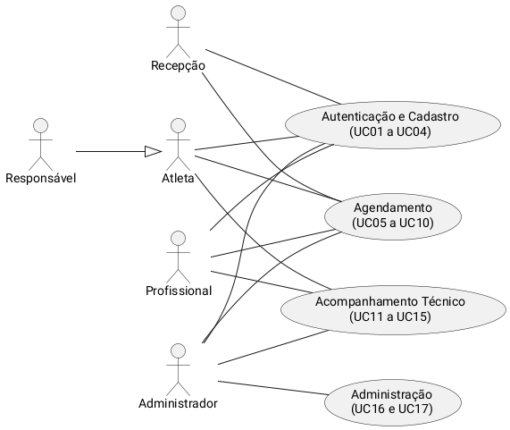
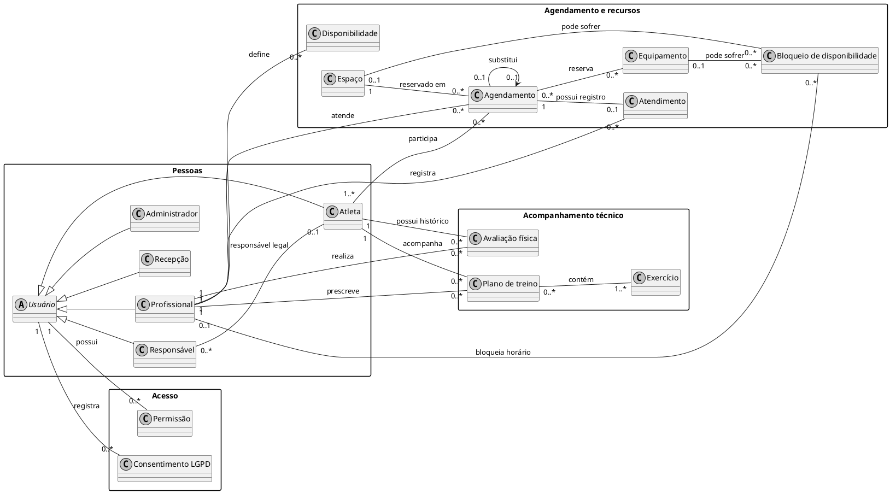

# **06 - Levantamento de Requisitos e Caso de Uso**

**Sistema:** PKZ LAB — Plataforma de Performance Integrada (Back-end / API REST)

---

## Introdução

Este documento consolida, no formato de Levantamento de Requisitos, as informações já elicitadas nos documentos de Pesquisa, Brainstorm, 5W2H e Design Thinking, e as organiza em requisitos funcionais e não funcionais rastreáveis, um caso de uso detalhado como exemplo, um resumo do protótipo de baixa fidelidade, os critérios de validação adotados e os diagramas de casos de uso e de classes já produzidos pela equipe.

Os requisitos aqui listados não são novos: são a formalização, em notação de Engenharia de Requisitos (RF/RNF, com prioridade e rastreabilidade), das ideias registradas como BS01 a BS16 no Brainstorm e detalhadas nos dezessete casos de uso (UC01 a UC17) do documento de Casos de Uso.

---

## **1. Identificação dos Stakeholders**

| Stakeholder | Papel no projeto |
| -- | -- |
| **PKZ LAB (Direção/Coordenação do CT)** | Patrocinador e cliente do sistema; define regras de negócio, prioridades e valida entregas. |
| **Atleta** | Usuário do centro de treinamento (do amador ao alto rendimento) que acompanha sua própria evolução, agenda e avaliações. |
| **Responsável** | Representa legalmente um atleta menor de idade (ECA); atua em nome do atleta vinculado. |
| **Profissional (equipe técnica)** | Personal Trainer, Preparador Físico, Fisioterapeuta e Nutricionista; realiza avaliações, prescreve planos de treino e atende agendamentos. |
| **Recepção** | Realiza agendamentos e consultas em nome de atletas e profissionais, com visão da agenda geral do CT. |
| **Administrador** | Coordenação do CT; gerencia usuários, permissões, espaços, equipamentos e possui visão irrestrita da agenda. |
| **Equipe de desenvolvimento** | Gabriel de Souza, Vitor Luiz Zanconato, Vitor Magalhães e Filipe Andrade; responsável pela modelagem e implementação do back-end em Django. |

---

## **2. Requisitos Funcionais**

Cada requisito funcional corresponde a um caso de uso do documento de Casos de Uso e tem origem em um ou mais requisitos elicitados no Brainstorm (BS01–BS16). A prioridade segue a classificação MoSCoW simplificada (Alta/Média/Baixa), coerente com o MVP definido no Mapa Mental.

| ID | Descrição | Prioridade | Origem (BS) | Caso de Uso |
| -- | -- | -- | -- | -- |
| RF01 | O sistema deve permitir que o usuário se autentique com e-mail e senha, carregando o painel conforme seu perfil. | Alta | BS12, BS13 | UC01 |
| RF02 | O sistema deve permitir que atletas e responsáveis se cadastrem na plataforma, com aceite dos termos de uso (LGPD). | Alta | BS01, BS13 | UC02 |
| RF03 | O sistema deve permitir a recuperação de senha via link enviado ao e-mail cadastrado. | Média | BS13 | UC03 |
| RF04 | O sistema deve permitir que o administrador cadastre/aprove contas de profissionais e recepção. | Alta | BS02, BS12, BS13 | UC04 |
| RF05 | O sistema deve permitir que o profissional defina sua disponibilidade e registre bloqueios de horário. | Alta | BS06 | UC05 |
| RF06 | O sistema deve permitir criar um agendamento cruzando a disponibilidade de atleta(s), profissional, espaço e equipamentos em uma única reserva. | Alta | BS05, BS06, BS11 | UC06 |
| RF07 | O sistema deve verificar automaticamente a disponibilidade de todos os recursos envolvidos antes de habilitar a confirmação de um agendamento. | Alta | BS06 | UC07 |
| RF08 | O sistema deve permitir reagendar um atendimento existente, revalidando a disponibilidade do novo horário. | Alta | BS05, BS06, BS14 | UC08 |
| RF09 | O sistema deve permitir cancelar um agendamento, mediante justificativa, liberando os recursos reservados. | Alta | BS10, BS14 | UC09 |
| RF10 | O sistema deve permitir consultar a agenda, filtrada por perfil e vínculos do usuário autenticado. | Alta | BS11, BS12 | UC10 |
| RF11 | O sistema deve permitir registrar o status do atendimento (presença, falta ou cancelamento), com autor, data e hora. | Média | BS08, BS10 | UC11 |
| RF12 | O sistema deve permitir registrar avaliações físicas do atleta (velocidade, força, resistência, agilidade), com comparação a avaliações anteriores. | Alta | BS03, BS07 | UC12 |
| RF13 | O sistema deve permitir prescrever e atualizar planos de treino, preservando o histórico de versões anteriores. | Alta | BS04, BS07 | UC13 |
| RF14 | O sistema deve apresentar indicadores de evolução do atleta ao longo do tempo. | Média | BS07, BS09 | UC14 |
| RF15 | O sistema deve gerar relatórios de desempenho, filtráveis por período e por atleta/profissional. | Média | BS09 | UC15 |
| RF16 | O sistema deve permitir que o administrador gerencie usuários e seus níveis de acesso. | Alta | BS12, BS13, BS14 | UC16 |
| RF17 | O sistema deve permitir que o administrador gerencie espaços, equipamentos e bloqueios por manutenção. | Alta | BS06, BS14 | UC17 |
| RF18 *(backlog futuro)* | O sistema deverá integrar-se a um sistema financeiro externo (cobrança/pagamentos). Fluxo ainda não detalhado; depende da definição do sistema de destino. | Baixa | BS16 | *(sem UC definido)* |

---

## **3. Requisitos Não Funcionais**

| ID | Categoria | Descrição |
| -- | -- | -- |
| RNF01 | Desempenho | A verificação de disponibilidade (UC07) deve responder em tempo hábil para não travar o fluxo de agendamento presencial na recepção. |
| RNF02 | Segurança | Senhas devem ser armazenadas com hash (nunca em texto puro) e toda comunicação cliente-servidor deve ocorrer via HTTPS. |
| RNF03 | Segurança / Privacidade | Dados de avaliação física e de saúde são tratados como dados sensíveis (LGPD) e só podem ser acessados por perfis autorizados e vinculados ao atleta. |
| RNF04 | Conformidade legal | O cadastro de atletas menores de 18 anos deve exigir vínculo e consentimento de um responsável (ECA), com registro de data e hora do consentimento (LGPD). |
| RNF05 | Usabilidade | Mensagens de erro relacionadas a autenticação devem ser claras porém genéricas (ex.: "e-mail ou senha incorretos"), evitando enumeração de usuários. |
| RNF06 | Auditabilidade | Cancelamentos e alterações de status não devem excluir registros; o histórico deve ser preservado para auditoria, com autor, data e hora. |
| RNF07 | Disponibilidade | O sistema deve estar operacional durante o horário de funcionamento do CT, com baixa tolerância a indisponibilidade. |
| RNF08 | Escalabilidade | A arquitetura deve suportar o crescimento do volume de atletas, profissionais e agendamentos sem necessidade de redesenho estrutural. |
| RNF09 | Tecnologia / Portabilidade | O back-end deve ser implementado como API REST em Django, permitindo o consumo por diferentes clientes (web e, futuramente, mobile). |
| RNF10 | Controle de acesso | O sistema deve aplicar controle de acesso por perfil (RBAC) em toda consulta e operação, e não apenas na interface. |

---

## **4. Caso de Uso Detalhado (Exemplo)**

Entre os dezessete casos de uso especificados no documento de Casos de Uso, <b>UC06 — Criar Agendamento</b> é reproduzido aqui como exemplo por representar o requisito mais crítico do sistema (RF06/RF07), que integra as demais funcionalidades.

#### **UC06 - Criar Agendamento**

- **Atores:** Atleta, Responsável, Profissional, Recepção, Administrador.
- **Pré-condição:** Usuário autenticado; existem profissionais, espaços e horários cadastrados.
- **Fluxo Principal:**
  1. Usuário acessa "Novo agendamento".
  2. Usuário informa tipo de agendamento (individual ou em grupo), atleta(s), profissional, data, horário de início e término, espaço, equipamentos (opcional) e repetição.
  3. Usuário aciona "Verificar disponibilidade" (**inclui UC07 — Verificar disponibilidade de recursos**).
  4. Sistema confirma que todos os recursos estão livres.
  5. Usuário confirma o agendamento.
  6. Sistema cria o agendamento com status "Agendado" e gera um número de protocolo.
- **Fluxos Alternativos:**
  - **FA1 — Conflito de disponibilidade:** sistema identifica o recurso em conflito e sugere ajuste; os dados preenchidos são preservados e o passo 3 é repetido.
  - **FA2 — Agendamento em grupo:** sistema limita a quantidade de atletas à capacidade do espaço selecionado.
  - **FA3 — Agendamento recorrente:** sistema executa a verificação para cada ocorrência da série e lista individualmente as datas com conflito.
- **Pós-condição:** Agendamento (ou série de agendamentos) registrado e disponível para consulta pelos perfis autorizados (UC10).

Os demais dezesseis casos de uso (UC01 a UC05 e UC08 a UC17), com o mesmo nível de detalhe, estão descritos integralmente no documento <b>Casos de Uso</b>.

---

## **5. Protótipo (Resumo)**

O protótipo de baixa fidelidade, detalhado no documento <b>Protótipo de Baixa Fidelidade</b>, cobre os dois fluxos essenciais desta iteração — autenticação/cadastro e agendamento com verificação automática de disponibilidade — em seis telas:

1. **Login** — E-mail, senha e opção "Manter-me conectado"; mensagens de erro genéricas por segurança.
2. **Cadastro** — Dados do usuário, tipo de perfil e, quando o atleta é menor de idade, vínculo obrigatório com um responsável (ECA/LGPD).
3. **Informações de agendamento** — Tipo, atleta(s), profissional, data/horário, espaço, equipamentos e repetição.
4. **Verificação de disponibilidade** — Exibe o status (disponível/ocupado) de cada recurso envolvido e, em caso de conflito, sugere um novo horário.
5. **Confirmação do agendamento** — Resumo do agendamento criado, com número de protocolo e status "Agendado".
6. **Minha agenda / Registro de status** — Lista filtrada por perfil, com opção de registrar presença, falta ou cancelamento.

Cada tela já possui, no documento original, uma tabela de elementos (tipo de componente, obrigatoriedade e regra de validação) e uma tabela de rastreabilidade direta com os endpoints previstos na API (ex.: Tela 3 → <code>POST /agendamentos/disponibilidade</code>), o que antecipa a modelagem do back-end em Django.

---

## **6. Validação**

Como o projeto está na fase inicial de documentação, a validação realizada até aqui foi predominantemente interna, por <b>revisão cruzada entre documentos</b>: cada novo artefato (Casos de Uso, Protótipo, Diagrama de Classes) foi confrontado com os requisitos elicitados no Brainstorm e no 5W2H, o que já gerou ajustes registrados no histórico de versões de mais de um documento (ex.: divisão do Diagrama de Casos de Uso em visão geral + quatro diagramas detalhados, para reduzir cruzamento de linhas).

- **Validação com o stakeholder (PKZ LAB):** apresentação do fluxo de agendamento e da lista de requisitos (RF/RNF) à coordenação do CT, para confirmar se prioridades e restrições (sem módulo financeiro, sem integração com sensores) permanecem corretas.
- **Revisão por rastreabilidade:** cada RF deve manter vínculo válido com um BS e, quando aplicável, com um UC — linhas sem essa referência indicam requisito não elicitado ou não implementado, e devem ser corrigidas.
- **Teste de usabilidade (planejado):** a ser conduzido com atletas, profissionais e recepção reais do PKZ LAB assim que houver uma versão navegável de alta fidelidade ou um MVP funcional em Django.

---

## Diagrama de Casos de Uso

Visão geral dos dezessete casos de uso, agrupados por área funcional (Autenticação e Cadastro, Agendamento, Acompanhamento Técnico e Administração). Os quatro diagramas detalhados por área estão no documento <b>Casos de Uso</b>.

---

## Diagrama de Classes

Diagrama de classes conceitual (visão de domínio, sem atributos e métodos), detalhado no documento <b>Diagrama de Classes</b>, com tabela de rastreabilidade completa entre classe, requisito e caso de uso.

---

## Conclusão

O Levantamento de Requisitos formalizou, em dezoito requisitos funcionais (RF01–RF18) e dez requisitos não funcionais (RNF01–RNF10), tudo o que já havia sido elicitado no Brainstorm, no 5W2H e especificado nos Casos de Uso. Essa formalização evidencia que a verificação de disponibilidade (RF07) é o requisito central do sistema — do qual dependem a criação e o reagendamento de atendimentos — e que exigências de conformidade legal (RNF03, RNF04) permeiam praticamente todos os fluxos que envolvem dados de atletas.

Este documento, junto ao Protótipo de Baixa Fidelidade e ao Diagrama de Classes, forma a base de requisitos a partir da qual a equipe seguirá para a modelagem de dados detalhada e a implementação do back-end em Django, em ciclos ágeis.

---

## Referências Bibliográficas

> SOMMERVILLE, Ian. Engenharia de Software. 10. ed. São Paulo: Pearson, 2019.

> PRESSMAN, R. S.; MAXIM, B. R. Engenharia de Software: uma abordagem profissional. McGraw-Hill, 2016.

> LARMAN, C. Utilizando UML e Padrões: uma introdução à análise e ao projeto orientados a objetos. Bookman, 2007.

> IEEE. IEEE Std 830-1998 — Recommended Practice for Software Requirements Specifications.

> PlantUML. Use Case Diagram e Class Diagram. Disponível em: https://plantuml.com

> BRASIL. Lei nº 13.709, de 14 de agosto de 2018. Lei Geral de Proteção de Dados Pessoais (LGPD).

> BRASIL. Lei nº 8.069, de 13 de julho de 1990. Estatuto da Criança e do Adolescente (ECA).

## Autor(es)

| Data | Versão | Descrição | Autor(es) |
| -- | -- | -- | -- |
| 27/09/2026 | 1.0 | Criação do documento de Levantamento de Requisitos, formalizando RF01–RF18 e RNF01–RNF10 a partir do Brainstorm, do 5W2H e dos Casos de Uso, com caso de uso, protótipo e diagramas de exemplo | Gabriel de Souza, Vitor Luiz Zanconato, Vitor Magalhães e Filipe Andrade |
