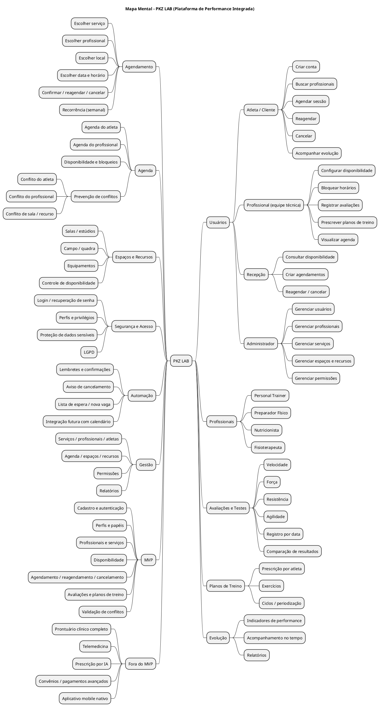

 
## Introdução
 

Mapa mental consiste em criar resumos cheios de símbolos, cores, setas e frases de efeito com o objetivo de organizar o conteúdo e facilitar associações entre as informações destacadas. Esse material é muito indicado para pessoas que têm facilidade de aprender de forma visual.

 
## Metodologia
 

A partir do escopo definido na pesquisa e no brainstorm do projeto, a equipe organizou os principais conceitos da plataforma do PKZ LAB em um mapa mental. O diagrama foi produzido em PlantUML e é renderizado diretamente nesta página.

 
## Mapa mental - Geral
 
## Versão 1.0
 
### Mapa mental — PKZ LAB
 

 
## Conclusão
 

O mapa mental é uma ficha de estudos que ajuda a dar uma visão geral do tema, e ajuda a fixar os pontos mais importantes sobre a plataforma do PKZ LAB.

 
## Referências
> BUZAN, Tony. Mapas Mentais e sua Elaboração. Cultrix, 2005.
 
> PlantUML. Mindmap diagram. Disponível em: https://plantuml.com/mindmap-diagram
 
## Versionamento
| Data | Versão | Descrição | Autor(es) |
| -- | -- | -- | -- |
| 08/09/2026 | 1.0 | Criação do mapa mental do PKZ LAB | _(preencher com a equipe)_ |
