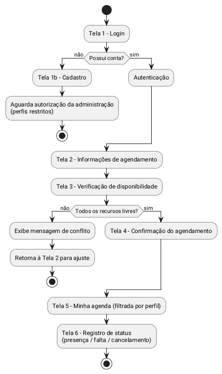
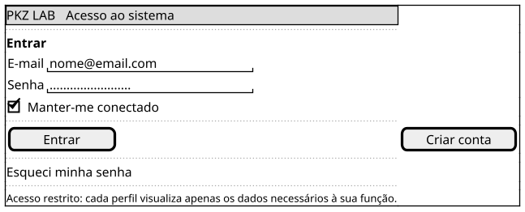
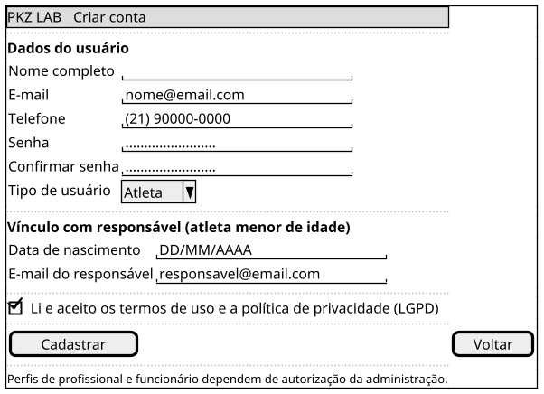
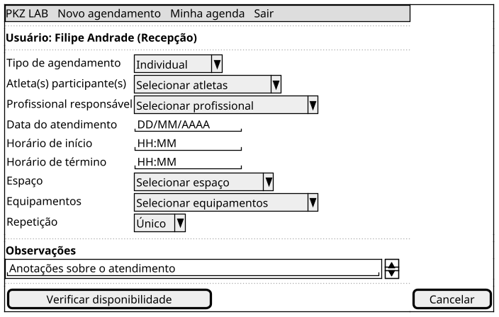
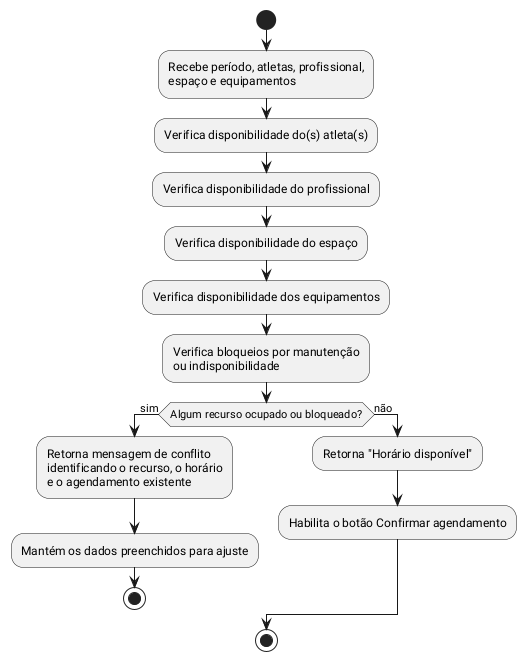
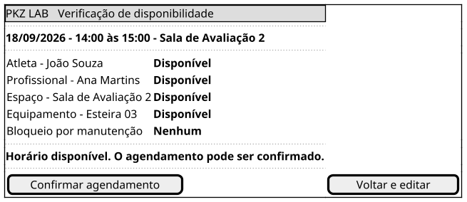
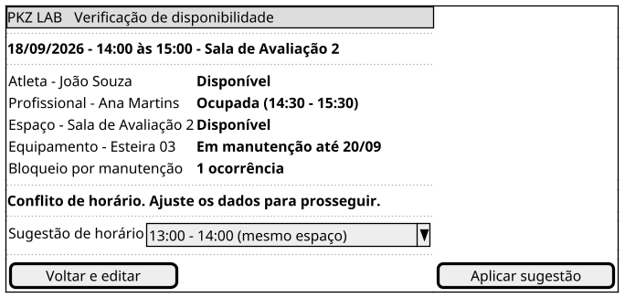
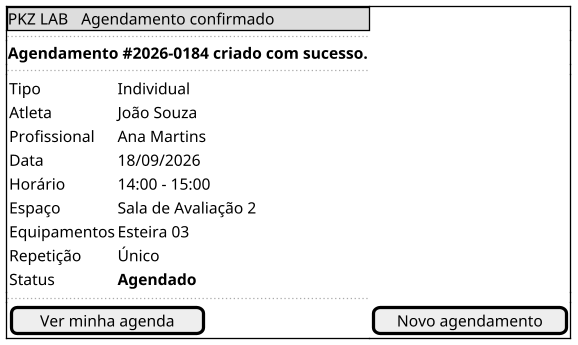
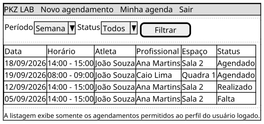
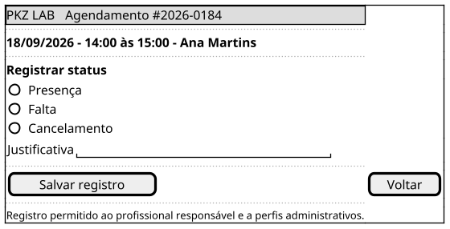

## Introdução

O protótipo de baixa fidelidade é a primeira representação visual da solução, feita antes de qualquer definição de identidade visual (cores, tipografia, ícones ou imagens). Seu objetivo é validar <b>estrutura, fluxo e regras de negócio</b> com baixo custo de retrabalho: como as informações se organizam na tela, em que ordem o usuário as preenche, quais campos são obrigatórios e quais verificações o sistema precisa executar antes de concluir uma ação.

Neste projeto, o protótipo tem um papel adicional: como o escopo do PKZ LAB é o desenvolvimento do <b>back-end (API REST)</b>, cada campo e cada botão desenhado aqui antecipa um atributo de entidade, um endpoint ou uma regra de validação que será implementada no servidor. As telas funcionam, portanto, como uma ponte entre o levantamento de requisitos e a modelagem de dados.

## Metodologia

A partir do escopo consolidado na pesquisa, no Brainstorm, no 5W2H e no mapa mental, a equipe elencou os fluxos essenciais para a primeira iteração do produto: <b>autenticação/cadastro</b> e <b>agendamento de atendimentos com verificação automática de disponibilidade</b>, que é a funcionalidade núcleo da plataforma.

Os wireframes foram desenhados em <b>PlantUML (Salt)</b> e são renderizados diretamente nesta página, o que mantém o protótipo versionado junto ao repositório e permite alterações rastreáveis por commit. A ferramenta <a href="https://www.figma.com">Figma</a> e o <a href="https://material.io/resources/color/#!/?view.left=0&view.right=0">Material Design Color Tool</a> ficam reservados para a etapa de alta fidelidade, quando a paleta e os componentes visuais forem definidos.

Cada tela é apresentada em três partes: o <b>wireframe</b>, a <b>tabela de elementos</b> (tipo de componente, obrigatoriedade e regra de validação) e as <b>regras de negócio</b> associadas, que servirão de base para os testes do back-end.

## Fluxo de navegação

## Perfis de usuário e visibilidade

O protótipo parte da premissa de que cada usuário acessa somente as informações necessárias à sua função, conforme exigido pela LGPD para dados pessoais e sensíveis de saúde. A tabela abaixo orienta o que cada tela deve exibir:

| Perfil | O que enxerga na agenda | Pode criar agendamento? |
| -- | -- | -- |
| Atleta | Apenas os próprios agendamentos | Sim, para si (conforme política do CT) |
| Responsável | Apenas os agendamentos do(s) atleta(s) vinculado(s) | Sim, para o dependente |
| Profissional | Apenas a própria agenda de atendimentos | Sim, dentro da própria disponibilidade |
| Recepção | Agenda geral do CT | Sim, para qualquer atleta/profissional |
| Coordenador / Administrador | Agenda geral, espaços, equipamentos e usuários | Sim, sem restrição de perfil |

---

## Protótipo de baixa fidelidade

### Versão 1.0

### Tela 1 — Login

**Elementos da tela**

| Elemento | Tipo | Obrigatório | Regra / validação |
| -- | -- | -- | -- |
| E-mail | Campo de texto | Sim | Formato de e-mail válido; usado como identificador único de login |
| Senha | Campo de senha | Sim | Mínimo de 8 caracteres; exibida mascarada |
| Manter-me conectado | Caixa de seleção | Não | Prolonga a validade da sessão no dispositivo |
| Entrar | Botão primário | — | Autentica e redireciona conforme o perfil do usuário |
| Criar conta | Botão secundário | — | Direciona para a Tela 1b (Cadastro) |
| Esqueci minha senha | Link | — | Envia link de redefinição para o e-mail cadastrado |

**Regras de negócio**

- Credenciais inválidas retornam mensagem genérica (*"E-mail ou senha incorretos"*), sem informar qual dos dois falhou, evitando enumeração de usuários.
- Contas pendentes de autorização da administração são bloqueadas com a mensagem *"Cadastro em análise pela administração"*.
- Após o login, o sistema aplica o controle de acesso por perfil, carregando apenas os dados permitidos.

---

### Tela 1b — Cadastro

**Elementos da tela**

| Elemento | Tipo | Obrigatório | Regra / validação |
| -- | -- | -- | -- |
| Nome completo | Campo de texto | Sim | Mínimo de 3 caracteres |
| E-mail | Campo de texto | Sim | Formato válido e único no sistema |
| Telefone | Campo de texto | Sim | Máscara `(DD) 9XXXX-XXXX` |
| Senha | Campo de senha | Sim | Mínimo de 8 caracteres, com letras e números |
| Confirmar senha | Campo de senha | Sim | Deve ser idêntica ao campo Senha |
| Tipo de usuário | Seleção | Sim | Atleta, Responsável, Profissional, Recepção ou Administrador |
| Data de nascimento | Campo de data | Sim | Define se o cadastro exige vínculo com responsável |
| E-mail do responsável | Campo de texto | Condicional | Exibido apenas quando o atleta é menor de 18 anos |
| Aceite dos termos | Caixa de seleção | Sim | Registra o consentimento exigido pela LGPD (data e hora) |
| Cadastrar | Botão primário | — | Cria a conta e dispara o fluxo de aprovação quando aplicável |

**Regras de negócio**

- **Menores de idade:** quando a data de nascimento indicar idade inferior a 18 anos, o bloco de vínculo torna-se obrigatório e a conta é associada a um pai ou responsável, que passa a visualizar os agendamentos do dependente (ECA e LGPD).
- **Aprovação administrativa:** cadastros com perfil de profissional, recepção ou administrador ficam com status *pendente* até autorização da administração; até lá, não recebem permissões operacionais.
- **Autocadastro de atleta:** perfis de atleta e responsável podem ser ativados diretamente, conforme a política do CT.
- O sistema recusa e-mails já cadastrados, sinalizando o campo com mensagem de erro.

---

### Tela 2 — Informações de agendamento

**Elementos da tela**

| Elemento | Tipo | Obrigatório | Regra / validação |
| -- | -- | -- | -- |
| Tipo de agendamento | Seleção | Sim | Individual ou em grupo; em grupo libera a seleção múltipla de atletas |
| Atleta(s) participante(s) | Seleção (múltipla no modo grupo) | Sim | Lista filtrada pelas permissões do usuário logado |
| Profissional responsável | Seleção | Sim | Somente profissionais ativos e habilitados para o tipo de atendimento |
| Data do atendimento | Campo de data | Sim | Não permite datas passadas |
| Horário de início | Campo de hora | Sim | Deve estar dentro do horário de funcionamento do CT |
| Horário de término | Campo de hora | Sim | Deve ser posterior ao horário de início |
| Espaço | Seleção | Sim | Lista de salas, quadras e áreas do CT |
| Equipamentos | Seleção múltipla | Não | Reserva os itens pelo período do atendimento |
| Repetição | Seleção | Sim | Único ou recorrente (diário, semanal, quinzenal) com data-limite |
| Observações | Área de texto | Não | Campo livre, sem dados sensíveis de saúde |
| Verificar disponibilidade | Botão primário | — | Executa a verificação da Tela 3 antes de qualquer confirmação |

**Regras de negócio**

- O botão **Confirmar agendamento** não é exibido nesta tela: a confirmação só é liberada após a verificação de disponibilidade.
- No modo **em grupo**, a capacidade máxima do espaço selecionado limita a quantidade de atletas.
- Em agendamentos **recorrentes**, a verificação é executada para cada ocorrência da série, e as datas com conflito são listadas individualmente.

---

### Tela 3 — Verificação de disponibilidade

Antes da confirmação, o sistema verifica se todos os elementos envolvidos no atendimento estão livres durante o período selecionado. Esta é a regra central do produto e a principal responsabilidade da API.

#### Resultado: horário disponível

#### Resultado: conflito identificado

**Mensagens do sistema**

| Situação | Mensagem exibida |
| -- | -- |
| Todos os recursos livres | "Horário disponível. O agendamento pode ser confirmado." |
| Atleta já agendado no período | "O atleta {nome} já possui atendimento das {hh:mm} às {hh:mm}." |
| Profissional já agendado | "O profissional {nome} já possui atendimento das {hh:mm} às {hh:mm}." |
| Espaço ocupado | "O espaço {nome} está reservado das {hh:mm} às {hh:mm}." |
| Equipamento indisponível | "O equipamento {nome} está reservado/indisponível no período." |
| Bloqueio por manutenção | "O recurso {nome} está bloqueado para manutenção até {data}." |
| Fora do horário de funcionamento | "O horário selecionado está fora do funcionamento do CT." |

**Regras de negócio**

- O sistema **impede reservas duplicadas ou com conflito de horário**: a confirmação só é habilitada quando todas as verificações retornam disponível.
- A verificação é refeita no momento da confirmação, evitando conflitos causados por agendamentos criados por outro usuário durante o preenchimento.
- Os dados preenchidos são preservados quando há conflito, para que o usuário apenas ajuste o item impeditivo.

---

### Tela 4 — Confirmação do agendamento

**Regras de negócio**

- Após a confirmação, o agendamento fica disponível para consulta pelos usuários autorizados, de acordo com seus respectivos perfis.
- Atletas e responsáveis visualizam apenas os agendamentos relacionados a eles; profissionais consultam a própria agenda; perfis administrativos possuem acesso mais amplo conforme suas permissões.
- O agendamento nasce com status **Agendado** e pode evoluir para **Realizado**, **Falta** ou **Cancelado**.

---

### Tela 5 — Minha agenda

**Regras de negócio**

- A consulta é sempre filtrada no back-end pelo perfil e pelos vínculos do usuário autenticado, e não apenas na interface.
- Filtros disponíveis: período (dia, semana, mês), status, profissional e espaço — estes dois últimos apenas para perfis administrativos.

---

### Tela 6 — Registro de status do atendimento

**Regras de negócio**

- O acompanhamento do status do atendimento (presença, falta ou cancelamento) está previsto no escopo do projeto e libera a devolução do espaço e dos equipamentos à agenda quando o registro for **Cancelamento**.
- Cancelamentos exigem justificativa e mantêm o histórico do agendamento para auditoria — o registro não é excluído.
- Toda alteração de status é registrada com autor, data e hora.

---

## Rastreabilidade com a API

A tabela a seguir associa cada tela do protótipo às operações previstas no back-end, servindo de referência para a modelagem de dados e para a definição dos endpoints na fase de Elaboração.

| Tela | Operação prevista na API | Entidades envolvidas |
| -- | -- | -- |
| Tela 1 — Login | `POST /auth/login` | Usuário, Perfil |
| Tela 1b — Cadastro | `POST /usuarios` | Usuário, Perfil, Responsável |
| Tela 2 — Agendamento | `GET /atletas`, `GET /profissionais`, `GET /espacos`, `GET /equipamentos` | Atleta, Profissional, Espaço, Equipamento |
| Tela 3 — Verificação | `POST /agendamentos/disponibilidade` | Agendamento, Bloqueio de manutenção |
| Tela 4 — Confirmação | `POST /agendamentos` | Agendamento |
| Tela 5 — Minha agenda | `GET /agendamentos` | Agendamento, Perfil |
| Tela 6 — Status | `PATCH /agendamentos/{id}/status` | Agendamento, Registro de presença |

## Conclusão

A elaboração do protótipo de baixa fidelidade permitiu validar o fluxo principal da plataforma antes de qualquer esforço de implementação: da autenticação até o registro do status do atendimento. O exercício evidenciou que a verificação de disponibilidade — envolvendo atleta, profissional, espaço, equipamentos e bloqueios de manutenção — é a regra que sustenta todo o produto, e que o controle de acesso por perfil precisa ser aplicado no back-end, e não apenas na interface.

As telas aqui definidas servirão de base para o levantamento de requisitos, para os casos de uso e para o protótipo de alta fidelidade, que acrescentará paleta de cores, tipografia e componentes visuais definitivos.

## Referências

> Material Design Color Tool. Disponível em: https://material.io/resources/color/#!/?view.left=0&view.right=0

> PMI. Um guia do conhecimento em gerenciamento de projetos. Guia PMBOK® 5a. ed. EUA: Project Management Institute, 2013.

> Ferramenta Figma. Disponível em https://www.figma.com

> PlantUML. Salt (Wireframe). Disponível em https://plantuml.com/pt/salt

> BRASIL. Lei nº 13.709, de 14 de agosto de 2018. Lei Geral de Proteção de Dados Pessoais (LGPD).

> BRASIL. Lei nº 8.069, de 13 de julho de 1990. Estatuto da Criança e do Adolescente (ECA).

## Autor(es)

| Data     | Versão | Descrição                                                                                | Autor(es)      |
| -------- | ------ | ---------------------------------------------------------------------------------------- | -------------- |
| 01/09/26 | 1.0    | Criação do documento                                                                     | Filipe Andrade |
| 01/09/26 | 1.1    | Adicionadas as telas de login, cadastro e agendamento com verificação de disponibilidade | Filipe Andrade |
| 01/09/26 | 1.2    | Adicionados fluxo de navegação, perfis de acesso, rastreabilidade com a API e conclusão  | Filipe Andrade |
